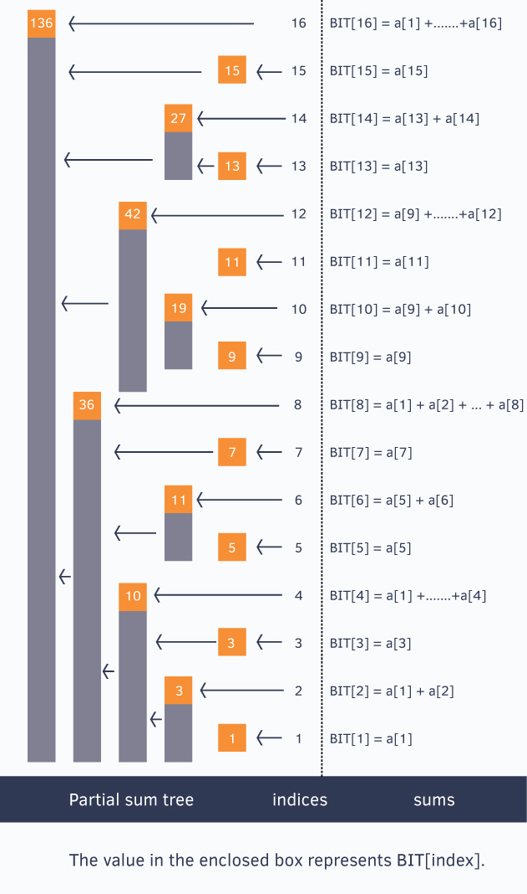

# Fenwick Tree
A Fenwick Tree is a data type providing efficient methods for storing values and manipulating cumulative value tables.

Fenwick tree is also called Binary Indexed Tree or BIT.

It supports the following operations:
* `sum(i)`: Cumulative sum of elements in the range [1..i]
* `sum(i, j)`: Cumulative sum of elements in the range [i..j]
* `update(i, v)`: Update ith element by an amount v ( v can be +ve or -ve)
* `scaleUp(c)`: Multiply all elements by an amount c
* `scaleDown(c)`: Divide all elements by an amount c

For a given array of N elements:
* Space Complexity: `O(N)`
* Time Complexity: `O(log N)` for `sum` and `update` and `O(N)` for `scaleUp` and `scaleDown` operations.

---
</br>

## Notations
Below are the notations we will be using throughout this article.
- `BIT` - Binary Indexed Tree
- `N` - size of the value table.
- `f[i]` - value at index `i : i ∈ [1..N]`
- `c[i]` - cumulative value at index i i.e. `c[i] = f[1] + f[2] + … + f[i]`
- `tree[i]` - the sum of values stored at index `i` of BIT (latter we will describe which values correspond to i); we will be using “tree value” to refer to “sum of values stored at an index of BIT”
- `num'` - complement of integer `num` (integer where each binary digit is inverted: 0 -> 1; 1 -> 0)
- `b`<sub>`m`</sub> - a binary number `b` of length `m`

---
</br>

## Basic idea
Each integer can be represented as a sum of powers of two. In the same way, a cumulative value can be represented as a sum of sets of subvalues. In our case, each set contains some successive number of non-overlapping values.

Let `i` be an index of BIT. Let `p` be the position of least significant non-zero bit in binary representaton of `i`. `tree[i]` holds the sum of values for indices `[(i - 2^p + 1)..i]`. We also write that `i` is responsible for indices from `[(i - 2^p + 1)..i]` (“responsibility” is the main notion that we will use in describing our algorithms).

</br>

> ***The position of the least significant bit (LSB) determines the range of responsibility that cell has to the cells below itself.***
>
> ***Example:***</br>
> ***Index 12 in binary is 1100:***</br>
> ***LSB is at position 3 to this index is responsible for 2^(3 -1) = 4 cells below itself.***
>
>   ***All odd numbers have their LSB set in the first position, so they are only responsible for themselves.***

</br>
<div align="center">
    
</div>

---
</br>

## Isolating LSB
    Given a number num, it can be represented as x1y in binary representation.
    Where x is some random binary number and y is all 0's after the rightmost set bit.
    num => x1y
    -num => 2's complement of num
       => (x1y)' + 1
       => x'0y' + 1 => y consists of all zeroes, so y' consists of all ones.
       => x'0(0…0)' + 1
       => x'0(1…1) + 1
       => x'1(0…0)
       => x'1y

    Right most set bit of num => num & -num
                            => x1y & x'1y
                            => 1y

    Remove last set bit of num => num - num & (-num)
                             => x1y - x1y & x'1b
                             => x1y - 1y
                             => x0y

>***In BIT, every node stores some partial range sum.</br>
>Suppose for index `i`, `j` is the value after removing its right most set bit.</br>
>So value of `tree[i]` will be the sum from elements between `[(j + 1)..i]` of the actual array.***
---
</br>

## Range Query
To get the prefix sum of `[1..i]`, simply keep adding the values at index `i` and update `i` after removing its right most set bit.

i.e. Start at `i` and cascade downwards until we reach 0 adding the value at each indices we encounter.

For example to get the sum of [1..13]</br>
&emsp;binary representation of 13 => 1101</br>
&emsp;sum(1, 13) => sum(13) + sum(9, 12) + sum(1, 8)</br>
&emsp;&emsp;&emsp;&emsp;&emsp;=> tree[13] + tree[12] + tree[8]</br>

```java
int read(int i) {
    int sum = 0;
    while (i > 0) {
        sum += tree[i];
        i -= i & -i;
    }
    return sum;
}

int read(int i, int j) {
    return read(j) - read(i - 1);
}
```

Time Complexity: O(log(N))

---
</br>

## Point Update
To update value at index i, we have to update BIT at all the indices which are responsible for the value at index i.
To get all those values, simply keep adding the last set bit in the i and keep updating the values.
In other words, we want to add the LSB to propagate the value up to the cells responsible for us.

```java
void update(int i, int val) {
    while (i <= N) {
        tree[i] += val;
        i += i & -i;
    }
}
```

Time Complexity: O(log(N))

---
</br>

## Read The Actual Value At A Position

The value at index `i` can be calculated by calling the function read twice – `f[i] = read(i) – read(i – 1)` — by taking the difference of two adjacent cumulative values. This procedure works in `2 * O(log(N))` time. There is a different approach that has lower running time complexity than invoking read twice, lower by a constant factor.

The main idea behind this approach is motivated by the following observation. Assume that we want to compute the sum of values between two indices. For each of the two indices, consider the path from the index to the root. These two paths meet at some index (at latest at index 0), after which point they overlap. Then, we can calculate the sum of the values along each of those two paths until they meet and subtract those two sums. In that way we obtain the sum of the values between that two indices.

We translate this observation to an algorithm as follows. Let `x` be an index and `y = x - 1`. We can represent (in binary notation) `y` as `a0b`, where `b` consists of all ones. Then, `x` is `a1b'` (note that `b'` consists of all zeros). Now, consider the first iteration of the algorithm sum applied to `x`. In the first iteration, the algorithm removes the last set bit of `x`, hence replacing `x` by `z = a0b'`.

Now, let us consider how the active index `i` of the function sum changes from iteration to iteration on the input `y`. The function read removes, one by one, the last set bits of `i`. After several steps, the active index `i` becomes `a0b'` (as a reminder, originally `i` was equal to `y = a0b`), that is the same as `z`. At that point we stop as the two paths, one originating from `x` and the other one originating from `y`, have met. Now, we can write our algorithm that resembles this discussion. (Note that we have to take special care in case `x` equals 0.).

```java
int readSingle(int i) {
    int sum = tree[i];
    if (i > 0) { // Special case for index 0
        int z = i - (i & -i);
        --i;
        while (i != z) {
            sum -= tree[i];
            i -= i & -i;
        }
    }
    return sum;
}
```

Time Complexity: O(log(N))

---
</br>

## 